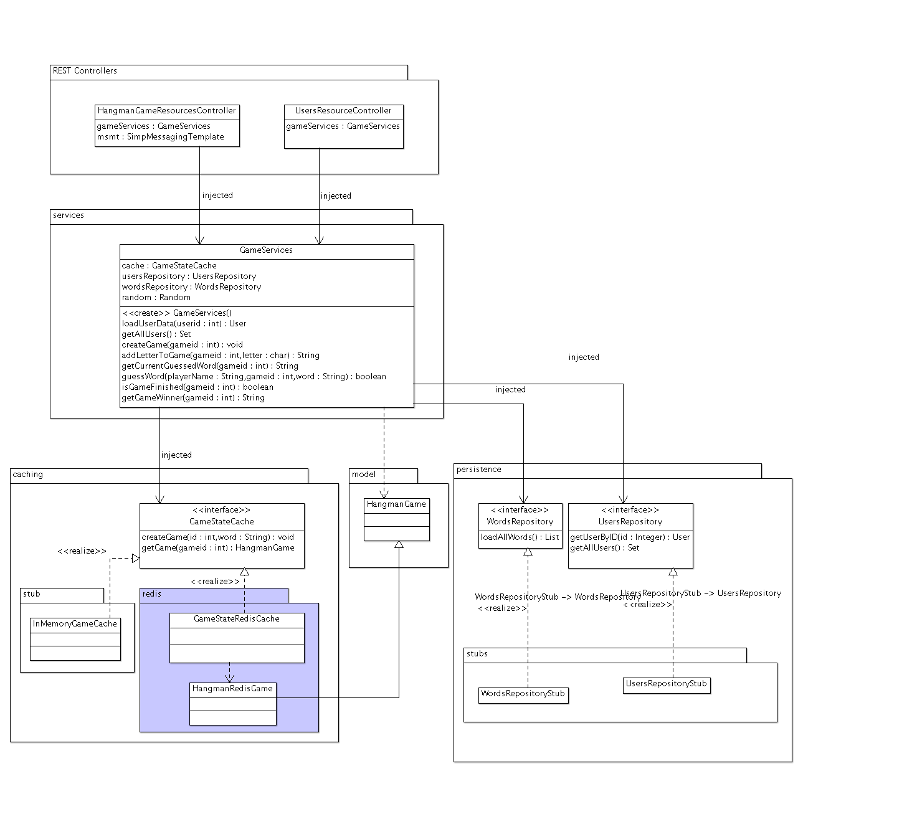

### Escuela Colombiana de Ingeniería
### Arquitecturas de Software - ARSW
## Ejercicio - Bases de datos NoSQL - Parte 1 (Llave/Valor)

En este ejercicio se va a retomar la aplicación del 'ahorcado en línea':



Como se observó en el ejercicio anterior, esta aplicación tiene el defecto de guardar datos provisionales (el estado de los 'ahorcados') en un mapa dentro de la memoria del servidor, lo cual crea inconsistencias cuando varias instancias de la misma son montadas bajo un esquema de balanceo de carga.

## Parte I

1. Inicie una de las máquina virtuales Ubuntu trabajada anteriormente, e <!--instale el servidor REDIS [siguiendo estas instrucciones](https://www.digitalocean.com/community/tutorials/how-to-install-and-use-redis), sólo hasta 'sudo make install'. Con esto, puede --> inicie el servidor con 'redis-server'. Nota: para poder hacer 'copy/paste' en la terminal (la de virtualbox no lo permite), haga una conexión ssh desde la máquina real hacia la virtual.
        
2. Como la aplicación aún no tiene la interfaz para crear nuevas partidas, se registrarán unas existentes directamente en Redis. Para esto revise [en la documentación de REDIS](http://redis.io/topics/data-types) el tipo de dato HASH, y la manera como se agregan tablas hash a una determianda llave. Con esto presente, inicie un cliente redis (redis-cli) en su máquina virtual, y usando los comandos respectivos, cree tres 'hash', uno para cada partida, identificados con la clave "game:1", "game:2", "game:3" (o con los identificadores que usted prefiera). A su vez, cada uno de los 'hash' anteriores debe tener: 
	* La palabra completa
	* La palabra que está siendo descubierta (la que tiene un '_' en lugar de los caracteres no adivinados aún).
	* Si el juego fue finalizado o no.
	* El nombre del ganador.


3. Agregue las dependencias requeridas para usar Jedis, un cliente Java para REDIS:

	```xml
        <dependency>
            <groupId>org.springframework.boot</groupId>
            <artifactId>spring-boot-starter-data-redis</artifactId>
        </dependency>                
 	```                               

4. En la ruta src/main/resources agregue un archivo application.yml con la siguiente configuración (DEBE incluír las tabulaciones):

	```yml
        spring:
  			redis:
    			host: 127.0.0.1
    			port: 6379
    			#password:
 	```                               
5. Ahora, va a hacer la implementación del 'GameStateRedisCache' siguiendo el esquema planteado en el diagrama anterior, donde:

	* Se creará la clase GameStateRedisCache.
	* Se creará la clase HangmanRedisGame, que heredará y SOBREESCRIBIRÁ todos los métodos de la clase HangmanGame.

6. Haga que a la clase GameStateRedisCache se le inyecte el 'StringRedisTempalte':

 	```java
    @Autowired
    private StringRedisTemplate template;    
 	```    

7. Haga que la clase HangmanRedisGame tenga como atributos adicionales (a los heredados) el identificador de la partida y el 'template' de redis, e incluya un constructor que permita inicializarlos.

8. Redefina todos los métodos heredados de la clase HangmanRedisGame (tryWord, addLetter, etc), para que en lugar de usar los valores almacenados en los atributos, haga uso de los valores almacenados en en caché, teniendo en cuenta el identificador de la partida. Tenga en cuenta [el API de Spring para el manejo del 'template' de Redis para Spring](https://docs.spring.io/spring-data/redis/docs/current/api/org/springframework/data/redis/core/StringRedisTemplate.html):

 	```java
	//consultar el valor en un hash
    String value=(String)template.opsForHash().get(key, property);           
	
	//actualizar el valor en un hash
	template.opsForHash().put(key,value,property)

 	```    

9. Una vez hecho lo anterior, haga que el método getGame() de _GameStateRedisCache_ retorne una instancia de HangmanRedisGame, a la cual se le pase el identificador y el 'template' de Redis.

10. Ajuste las anotaciones para que la aplicación inyecte el esquema de Caché basado en Redis en lugar del basado sólo en memoria.

11. Actualice la aplicación en el esquema de balanceo de carga, y rectifique nuevamente el funcionamiento. Para esto debe tener una instancia de Redis en una de las máquinas virtuales, y ambas instancias de la aplicación configuradas para hacer uso de la misma.


### Nota - Error de SockJS

En caso de que con la configuración planteada (aplicación y REDIS corriendo en la máquina virtual) haya conflictos con SockJS:<!--, hay dos soluciones alternativas para terminar el ejercicio:-->

<!--1.--> Configurar REDIS para aceptar conexiones desde máquinas externas, editando el archivo /home/ubuntu/redis-stable/redis.conf, cambiando "bind 127.0.0.1" por "bind 0.0.0.0", y reiniciando el servidor con: 

```bash
redis-server /home/ubuntu/redis-stable/redis.conf. 
```

Una vez hecho esto, en la aplicación ajustar el archivo jedis.properties, poner la IP de la máquina virtual (en lugar de 127.0.0.1), y ejecutarla desde el equipo real (en lugar del virtual). ** OJO: Esto sólo se hará como prueba de concepto!, siempre se le debe configurar la seguridad a REDIS antes de permitirle el acceso remoto!. **

<!--2. Usar la misma configuración, hacer la configuración de NGINX del ejercicio anterior. No se debe olvidar agregar (al igual que en el ejercicio anterior) el permiso para aceptar orígenes alternativos:

	```java
	@Override
	public void registerStompEndpoints(StompEndpointRegistry registry) {
		registry.addEndpoint("/stompendpoint").setAllowedOrigins("*").withSockJS();

	}
	```
-->

### Parte IV - Para el Martes, Impreso. 


Actualizar (y corregir) el diagrama realizado en el laboratorio anterior, incluyendo el diagrama de despliegue de la solución incluyendo la base de datos en memoria. Si la herramienta de diseño no permite hacer diagramas de despliegue incluyendo componentes con puertos, hacer dos diagramas aparte: componentes detallado, y despliegue, con los componentes 'grandes'.
